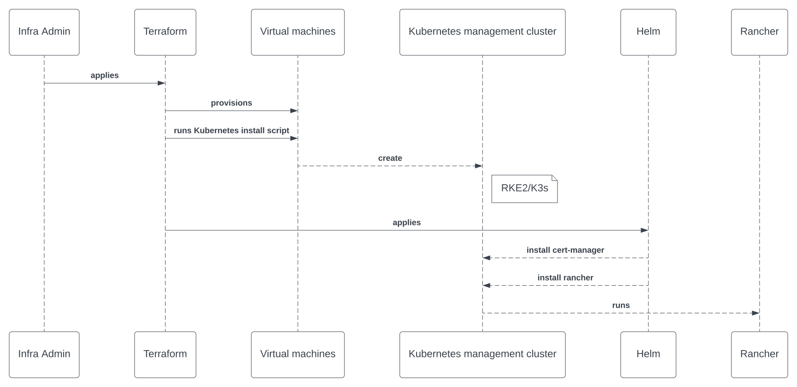

# Automation with Rancher

## Terraform

* [Rancher2 Provider](https://registry.terraform.io/providers/rancher/rancher2/latest/docs) ([code](https://github.com/rancher/terraform-provider-rancher2))

## Usecases

### Kubernetes management cluster with Rancher

### RKE1 cluster from Rancher

* [RKE Templates and Infrastructure > Terraform](https://ranchermanager.docs.rancher.com/how-to-guides/new-user-guides/authentication-permissions-and-global-configuration/about-rke1-templates/infrastructure#terraform)

## Code examples

* [Devpro Terraform projects](https://github.com/devpro/terraform-projects)
* [Rancher quickstarts](https://github.com/rancher/quickstart)
